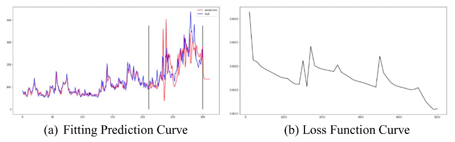
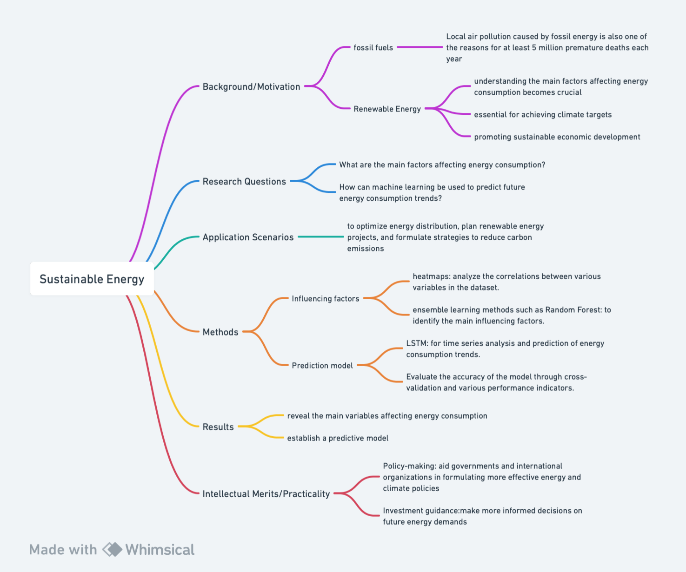

## 1.1
### Title: 
Prediction of Post-COVID-19 economic and environmental policy and recovery based on recurrent neural network and long short-term memory network 

### Background/Motivation:
The COVID-19 pandemic has had profound implications for global economic and environmental systems. In these turbulent times, assessing the Global Economic-and-environmental Policy Uncertainty (GEPU) index becomes imperative as it offers insights into the instability associated with worldwide economic policies. Accurately forecasting this index post-pandemic can assist in understanding the trajectory of economic and environmental policy recoveries and their implications.

### Research Question:
The central inquiry of this study is: 
•	After the COVID-19 pandemic, how can machine learning techniques be applied to predict the trajectory of the GEPU index?
•	What do these predictions indicate about the future state of global economic and environmental policies?

### Application Scenarios:
The prediction of the GEPU index has vast applications. Primarily, it serves as an evidence-based tool to gauge the potential outlook of global economic and environmental policy and its recovery. Furthermore, businesses, investors, policymakers, and researchers can apply these predictions to strategies by understanding the uncertainties and making informed decisions.

### Methodology:
Since RNN and LSTM models have strong sequence learning and prediction abilities due to their network structural properties, they are used to fit complex nonlinear GEPU indices. Based on the size of the training set, a suitable intermediate layer is set up, and the data smoothing process is disregarded from a practical point of view to prevent the loss of information. The modeling framework is shown below. First, different numbers are set for the hidden layer because of the problem’s complexity and computation time. Second, the number of months used for prediction is adjusted, and quarterly or half-yearly is selected according to actual factors. The trend of the GEPU index was then forecasted using RNN and LSTM networks with different hidden layers and back-time combinations. Following that, the training and test sets' errors were compared with various network parameter combinations, and diagnostic and robustness tests were run.

### Results:
When look_back = 3 and hiden_layer = 3, the RNN model performs best. In this situation, the results show that GEPU will rise somewhat before leveling out. It shows that two years after the outbreak, the CKP epidemic's influence on GEPU is progressively leveling down, which is beneficial to economic recovery. This is due to computers' limited computational power and time. It is realistic to expect improved learning outcomes if the Epoch continues to expand at a reasonable rate. 

Fig. 1 look_back = 3, hiden_layer = 3 (Hu et al., 2022)

When look_back and hiden_layer  are respectively 3 and 6, or 6 and 3, the result of LSTM is worse than that of the RNN. When hiden_layer = 6, the LSTM shows obvious overfitting. It indicates that the fitting curve on the training set is more complex than that on the real dataset. 

Fig. 2 look_back = 3, hiden_layer = 6 (Hu et al., 2022)

Limitations: Neural networks are black-box models, such as LSTM and RNN. In this case, it is a hard task to identify the specific paths that affect changes in economic and environmental policy uncertainty in this paper. 

### Intellectual Merits/Practical Impacts:
The study's findings offer several pivotal takeaways:
- Economic Impacts: A stable or decreasing GEPU index implies reduced economic policy uncertainty, which is conducive to global economic recovery. This state of stability presents promising prospects for investors and businesses, indicating a more predictable and dependable macroeconomic environment.
- Environmental Impacts: From an ecological perspective, a declining GEPU index signifies a diminishing direct influence of policy uncertainties on sustainable development. However, the study cautions that indirect environmental repercussions due to these uncertainties might persist over a more extended period.
- Policy and Research Implications: These predictions can guide subsequent policy formulation and can be instrumental for future research, offering a foundational reference point for investigations into the broader socio-economic and environmental ramifications of the pandemic.

## 1.2

### Background/Motivation

Three-quarters of global emissions come from the combustion of fossil fuels. Local air pollution caused by fossil energy is also one of the reasons for at least 5 million premature deaths each year (Wen et al., 2021). With the growing global demand for renewable energy, understanding the main factors affecting energy consumption becomes crucial. The proliferation of renewable energy is essential for achieving climate targets, reducing dependence on fossil fuels, and promoting sustainable economic development. This study aims to analyze the key factors affecting energy consumption and predict future consumption trends to provide data support for policy-making or investment decision.

### Research Questions

This study will address the following questions:
- What are the main factors affecting energy consumption?
- How can machine learning be used to predict future energy consumption trends?

### Application Scenarios

The research results will be helpful for energy policymakers, energy companies, and environmental scientists, who can use these findings to optimize energy distribution, plan renewable energy projects, and formulate strategies to reduce carbon emissions.

### Methods

- Use heatmaps to analyze the correlations between various variables in the dataset.
- Apply PCA to identify and quantify the most influential features.
- Use ensemble learning methods such as Random Forest and GBM to identify the main influencing factors.
- Utilize LSTM for time series analysis and prediction of energy consumption trends.
- Evaluate the accuracy of the model through cross-validation and various performance indicators.

### Results

The expected results will reveal the main variables affecting energy consumption and establish a predictive model capable of accurately forecasting short-term and long-term energy consumption trends.

### Intellectual Merits/Practicality

The practicality of the research lies in its ability to provide actionable insights, which can help decision-makers formulate data-based strategies to address future challenges in energy consumption. Additionally, the developed predictive model can provide energy market participants with highly accurate predictions of future consumption trends, which are crucial for long-term planning and investment decisions. The intellectual merit primarily lies in the use of advanced machine learning techniques to process and analyze large amounts of complex data, which can reveal patterns and correlations that traditional statistical methods may overlook.

Furthermore, the practicality of the predictive model is also reflected in the following aspects:

- Policy-making: The results will aid governments and international organizations in formulating more effective energy and climate policies.
- Investment guidance: Investors in the energy sector can make more informed decisions on future energy demands and investments in renewable energy projects based on the predictions.
- Education and awareness: Increase public awareness of the importance of renewable energy and how it affects the long-term sustainability of the economy and the environment.

### Reference
Hu, Hui, Shuaizhou Xiong, Yi Chen, Ye Lin, Shuliang Zhao, Kun Qian, and Michael De Domenici C. "Prediction of Post-COVID-19 Economic and Environmental Policy and Recovery Based on Recurrent Neural Network and Long Short-Term Memory Network." Environmental Research Communications 4, no. 11 (11, 2022): 115001. Doi:https://doi.org/10.1088/2515-7620/ac9bd8. https://login.proxy.lib.duke.edu/login?url=https://www.proquest.com/scholarly-journals/prediction-post-covid-19-economic-environmental/docview/2731784886/se-2

Jun Wen, Chukwuemeka Valentine Okolo, Ifeanyi Celestine Ugwuoke, Kibir Kolani,
Research on influencing factors of renewable energy, energy efficiency, on technological innovation. Does trade, investment and human capital development matter?,
Energy Policy, Volume 160, 2022, 112718, ISSN 0301-4215, https://doi.org/10.1016/j.enpol.2021.112718. 

