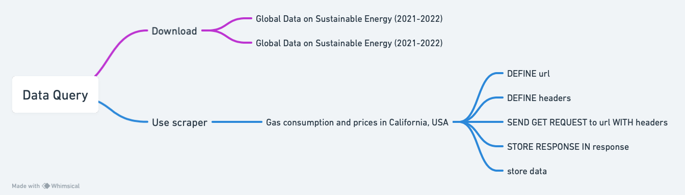

# Data Querying
  The main part of the data was directly downloaded from
1.	 https://www.kaggle.com/datasets/anshtanwar/global-data-on-sustainable-energy, which is an open data source sorted by Ansh Tanwar. 
2.	 New data for 2021-2022 from the World Bank https://datacatalog.worldbank.org/search/dataset/0037712/World-Development-Indicators

  Additionally, there is also a data query code, which is used for scraping data on the EIA website, including gas consumption and prices in California, USA. As for the process, I first asked ChatGPT to write a general query code for me. And then, I made up the specific headers and API URL; dealt with the OSError, which refers to the proxy problem. The code and pseudo-code are as shown below.
 
  The last sample code might be potentially applied, feel free to check if you are interested!!


### Code
```
pip install requests
import requests
import json

url = "https://api.eia.gov/v2/natural-gas/sum/lsum/data/"

headers = {
    'X-Params': json.dumps({
        "frequency": "annual",
        "data": ["value"],
        "facets": {"series": ["N3010CA2", "N3010CA3"]},
        "start": "2013",
        "end": "2023",
        "sort": [{"column": "period", "direction": "desc"}],
        "offset": 0,
        "length": 5000
    })
}

response = requests.get(url, headers=headers)

if response.status_code == 200:
    # Parsing the response JSON
    data = response.json()
    print(data)
else:
    print(f"Failed to retrieve data: {response.status_code}")

```

###  pseudo-code
```
DEFINE url AS "https://api.eia.gov/v2/natural-gas/sum/lsum/data/"

DEFINE headers AS MAP OF:
    'X-Params': STRINGIFIED JSON OF:
        "frequency": "annual"
        "data": LIST CONTAINING "value"
        "facets": MAP OF "series": LIST CONTAINING "N3010CA2", "N3010CA3"
        "start": "2013"
        "end": "2023"
        "sort": LIST CONTAINING MAP OF "column": "period", "direction": "desc"
        "offset": 0
        "length": 5000

SEND GET REQUEST to url WITH headers
STORE RESPONSE IN response

IF response status code IS 200 THEN
    PARSE response content AS JSON
    PRINT parsed data
ELSE
    PRINT "Failed to retrieve data: " AND response status code
```

### flowchart



### Potential application

What's more,

I would like to attach a sample crawler code written by me here. Potentially, it might be used to check citizens' feelings of sustainable energy, which are also an important factor for policy-makers and investors.
```
import os
import re
import requests
import pandas as pd
import datetime
from jsonpath import jsonpath

headers = { ... }  

def trans_time(v_str):
    # Switch to the standard time: Year-Month-Day Hour:min:second"""

def getLongText(v_id):
    # Function for fetching long text

def get_weibo_list(v_keyword, v_max_page, v_weibo_file):
    all_data = []
    for page in range(1, v_max_page + 1):
        url = 'https://m.weibo.cn/api/container/getIndex'
        params = { ... }  
        response = requests.get(url, headers=headers, params=params)
        if response.status_code != 200:
            continue
        cards = response.json()["data"]["cards"]
        for card in cards:
            if 'mblog' in card:
                mblog = card['mblog']
                text = re.sub(r'<[^>]+>', '', mblog.get('text', ''))
                if mblog.get('isLongText'):
                    text = getLongText(mblog['id'])
                time_str = trans_time(mblog.get('created_at', ''))
                all_data.append([
                    page, mblog['id'], mblog['user']['screen_name'], 
                    mblog['user'].get('verified', False),
                    time_str, mblog.get('region_name', '未知地区'), text, 
                    mblog.get('reposts_count', 0), 
                    mblog.get('comments_count', 0), 
                    mblog.get('attitudes_count', 0)
                ])
    df = pd.DataFrame(all_data, columns=['页码', '微博id', '微博作者', '是否认证', '发布时间', '发布地点', '微博内容', '转发数', '评论数', '点赞数'])
    if not df.empty:
        if os.path.exists(v_weibo_file):
            df.to_csv(v_weibo_file, mode='a+', index=False, header=False)
        else:
            df.to_csv(v_weibo_file, index=False)

if __name__ == '__main__':
    max_search_page = XXX
    search_keyword = '可再生能源'
    v_weibo_file = '微博清单_{}_前{}页.csv'.format(search_keyword, max_search_page)
    if os.path.exists(v_weibo_file):
        os.remove(v_weibo_file)
    get_weibo_list(v_keyword=search_keyword, v_max_page=max_search_page, v_weibo_file=v_weibo_file)
    df = pd.read_csv(v_weibo_file)
    df.drop_duplicates(subset=['微博id'], inplace=True)
    df.to_csv(v_weibo_file, index=False)

```
